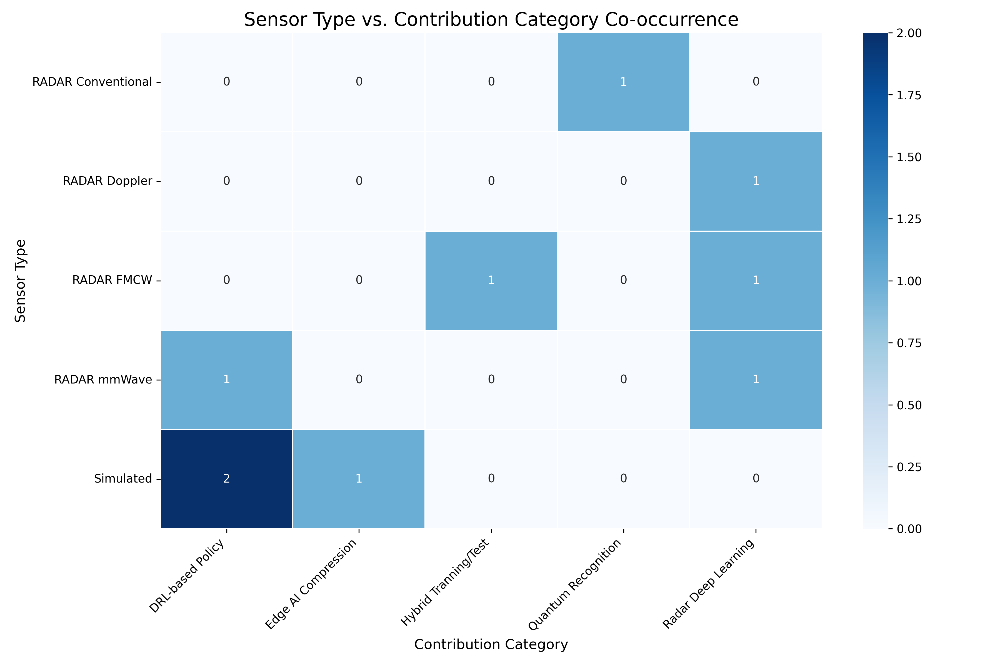
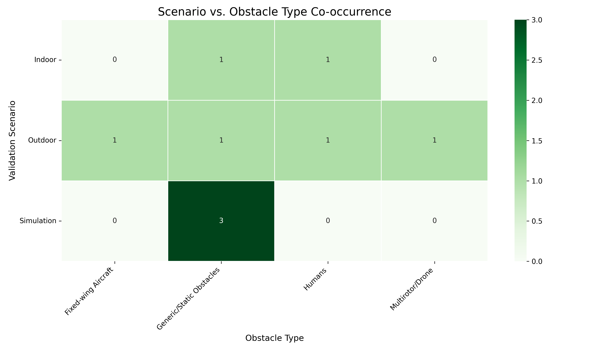

[← Back to Qualification](../README.md)

# 3. Included Studies & Data Extraction

This directory contains the final set of **9 studies** included in the Systematic Literature Review (SLR) after the full-text assessment. These papers represent the intersection of **Radar**, **Artificial Intelligence**, and **UAV Collision Avoidance** technologies.

### 📥 References

- **[Download Included Studies (.bib)](./included.bib)** _(Contains the BibTeX citations for the final papers selected for extraction)_

### 📂 File Structure

- **`data_table.csv`**: The master extraction table containing structured data for every included paper.
- **`included.bib`**: BibTeX file with the final studies.
- **Visualization Scripts**:
  - `ai_radar_distribution.py` (Generates `ai_radar_distribution.png`)
  - `validation_matrix.py` (Generates `validation_matrix.png`)

---

### 📈 Data Summary

An overview of the key technologies and performance metrics extracted from the selected studies.

#### Full Extraction Table

| Article                  | Radar Type    | AI Model        | Scenario          | Accuracy / Metrics    |
| :----------------------- | :------------ | :-------------- | :---------------- | :-------------------- |
| **AlGhayadh (2024)**     | Conventional  | Quantum Rec.    | Static Outdoor    | **99.25%** (Accuracy) |
| **Holbrook (2022)**      | FMCW          | SVM             | Outdoor (UAVs)    | **88.9%** (Accuracy)  |
| **Jevtić (2023)**        | Simulated     | RL (Q-Learning) | Multi-agent Sim   | **High Success Rate** |
| **Lahsen-Cherif (2022)** | Simulated     | Embedded DNN    | Horizontal Sim    | **99.7%** (Safety)    |
| **Parralejo (2023)**     | mmWave        | CNN + DBSCAN    | Indoor (Humans)   | **99.32%** (Accuracy) |
| **Rubí (2021)**          | Simulated     | DRL (DDPG)      | Obstacle Sim      | **99.0%** (Success)   |
| **Safa (2023)**          | FMCW          | VAE             | Indoor            | **RMSE: 0.75m**       |
| **Tian (2024)**          | Pulse Doppler | FCN             | Urban             | **80%** (Pd)          |
| **Zhang (2025)**         | Simulated     | DRL + Filtering | Dynamic Obstacles | **High Robustness**   |

> **Note**: Full details on latency, computational cost, and robustness are available in the `data_table.csv` file.

---

### 📊 Visual Analytics

The following heatmaps were generated from the extracted data to visualize trends in the field.

#### 1. Sensor Technology vs. Application Category

This matrix correlates the type of radar technology used (e.g., FMCW, mmWave) with the **research category defined for this review**.



#### 2. Operational Scenarios vs. Obstacle Types

This matrix shows the testing environments (Indoor, Outdoor, Simulation) against the types of obstacles used in validation (Humans, Other Drones, Static Objects).



---

### 📚 List of Included Studies

1. **AlGhayadh et al. (2024)** - _Quantum Target Recognition Enhancement Algorithm for UAV Consumer Applications_
2. **Holbrook et al. (2022)** - _Aerial Object Trajectory Classification by Training on Flight Controller Data and Testing on RADAR_
3. **Jevtić et al. (2023)** - _Reinforcement Learning-based Collision Avoidance for UAV_
4. **Lahsen-Cherif et al. (2022)** - _Real-Time Drone Anti-Collision Avoidance Systems: An Edge AI Application_
5. **Parralejo et al. (2023)** - _Millimetre Wave Radar System for Safe Flight of Drones in Human-Transited Environments_
6. **Rubí et al. (2021)** - _Quadrotor Path Following and Reactive Obstacle Avoidance with Deep Reinforcement Learning_
7. **Safa et al. (2023)** - _FMCW Radar Sensing for Indoor Drones Using Variational Auto-Encoders_
8. **Tian et al. (2024)** - _Fully Convolutional Network-Based Fast UAV Detection in Pulse Doppler Radar_
9. **Zhang et al. (2025)** - _Research on Dynamic Obstacle Avoidance... Based on Deep Reinforcement Learning_

### ⚙️ How to Reproduce the Visuals

To regenerate the images above, run the python scripts provided in this directory:

```bash
# Create environment
python -m venv .venv

# Active environment
source .venv/bin/activate

# Install dependencies
pip install -r requirements.txt

# Generate Sensor Heatmap
python ai_radar_distribution.py

# Generate Scenario Heatmap
python validation_matrix.py

# Deactive environment
deactivate
```
