[← Back to Thesis Overview](../README.md)

# Systematic Literature Review: Detect and Avoid Systems (Radar & AI)

This repository documents the workflow and artifacts of the Systematic Literature Review (SLR) focused on **Detect and Avoid (DAA)** systems using Radar and Artificial Intelligence. The process is organized into sequential steps to ensure research reproducibility and traceability, following [PRISMA](https://www.youtube.com/watch?v=KeKpVgydlAQ) guidelines.

## 🔎 Search Execution Log

Summary of the systematic search process conducted across 6 scientific databases.

| Database Source         | Date       | Raw Hits | Imported (Post-Filter) | Query Link                                                        |
| :---------------------- | :--------- | :------: | :--------------------: | :---------------------------------------------------------------- |
| **Scopus**              | 22/09/2025 |   135    |        **118**         | [View](./1.%20automated%20queries/generated_queries/SCOPUS.query) |
| **Web of Science**      | 22/09/2025 |    26    |         **22**         | [View](./1.%20automated%20queries/generated_queries/WOS.query)    |
| **IEEE Xplore**         | 22/09/2025 |   136    |        **123**         | [View](./1.%20automated%20queries/generated_queries/IEEE.query)   |
| **ACM Digital Library** | 22/09/2025 |   126    |         **90**         | [View](./1.%20automated%20queries/generated_queries/ACM.query)    |
| **AIAA ARC**            | 22/09/2025 |    55    |         **15**         | [View](./1.%20automated%20queries/generated_queries/AIAA.query)   |
| **NASA NTRL**           | 22/09/2025 |    51    |         **12**         | [View](./1.%20automated%20queries/generated_queries/NASA.query)   |
| **TOTAL**               |            | **529**  |        **380**         |                                                                   |

### 📉 PRISMA Flow Summary

- **Identification:** 380 records imported.
- **Deduplication:** 38 duplicates removed (342 unique records).
- **Screening:** 317 records excluded based on title/abstract.
- **Eligibility:** 25 full-text articles assessed.
- **Inclusion:** **9 studies included**.

## 🗂️ Workflow and Steps

Below are the steps completed and documented so far. Click on the diagram nodes below to navigate to the detailed documentation for each step.

```mermaid
graph LR
    %% Nodes
    S0(Step 0: Initial Scoping Review)
    S1(Step 1: Automated Queries)
    S2(Step 2: Screening & Filtering)
    S3(Step 3: Included Studies & Analysis)

    %% Connections
    S0 -->|Defined Keywords| S1
    S1 -->|380 Records| S2
    S2 -->|9 Included| S3

    %% Clickable Links
    click S0 "https://github.com/taffarel55/masters-thesis/blob/main/qualification/0.%20review%20articles/README.md" "Go to Step 0"
    click S1 "https://github.com/taffarel55/masters-thesis/blob/main/qualification/1.%20automated%20queries/README.md" "Go to Step 1"
    click S2 "https://github.com/taffarel55/masters-thesis/blob/main/qualification/2.%20screening/README.md" "Go to Step 2"
    click S3 "https://github.com/taffarel55/masters-thesis/blob/main/qualification/3.%20included/README.md" "Go to Step 3"

    %% Styling
    style S0 fill:#e3f2fd,stroke:#1565c0,stroke-width:2px,color:#000
    style S1 fill:#fff3e0,stroke:#ef6c00,stroke-width:2px,color:#000
    style S2 fill:#fbe9e7,stroke:#d84315,stroke-width:2px,color:#000
    style S3 fill:#e8f5e9,stroke:#2e7d32,stroke-width:2px,color:#000
```

### 📍 [Step 0: Initial Scoping Review](./0.%20review%20articles/README.md)

**Exploration and Foundation Phase**
In this initial stage, a scoping review was conducted to identify key concepts, terminology, and dominant technologies in the field.

- **Deliverable:** Preliminary article base (`review.bib`) that grounded the keyword selection.
- ➡️ **[Read Step 0 complete documentation](./0.%20review%20articles/README.md)**

### 📍 [Step 1: Automated Search Queries](./1.%20automated%20queries/README.md)

**Search Strategy Definition and Translation**
Automation of search string generation for multiple scientific databases (IEEE, ACM, Scopus, WoS, etc.), ensuring syntactic consistency.

- **Deliverable:** Python generation scripts (`generateQueries.py`), term configuration file (`config.ini`), and ready-to-use queries.
- ➡️ **[Read Step 1 complete documentation](./1.%20automated%20queries/README.md)**

### 📍 [Step 2: Screening & Filtering](./2.%20screening/README.md)

**Relevance Assessment**
Manual screening of the raw search results based on titles, abstracts, and keywords to identify studies that strictly meet the intersection of Radar, AI, and Aviation safety.

- **Deliverable:** Filtered bibliography (`screened.bib`) and exclusion log (`reasons_removed.txt`).
- ➡️ **[Read Step 2 complete documentation](./2.%20screening/README.md)**

### 📍 [Step 3: Included Studies & Data Extraction](./3.%20included/README.md)

**Full-Text Review and Analysis**
The final selection of 11 studies was analyzed to extract quantitative data. Python scripts were developed to visualize relationships between sensor types, AI models, and operational scenarios.

- **Deliverable:** Extraction Matrix (`data_table.csv`), Final Bibliography (`included.bib`), and Data Visualization Scripts.
- ➡️ **[Read Step 3 complete documentation](./3.%20included/README.md)**
